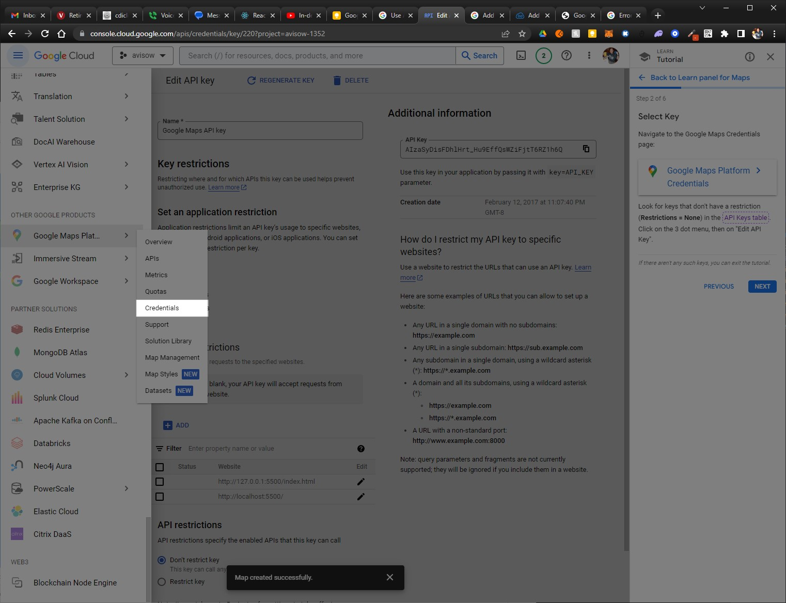
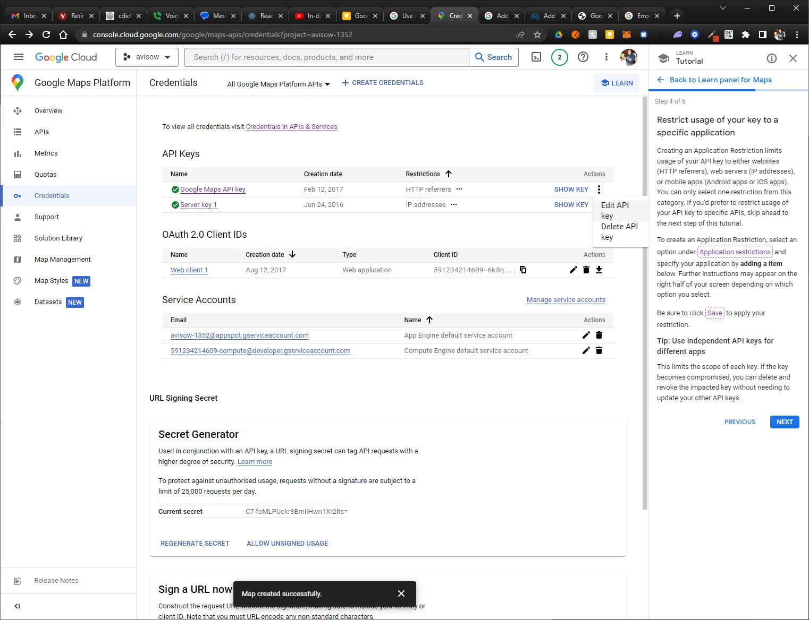
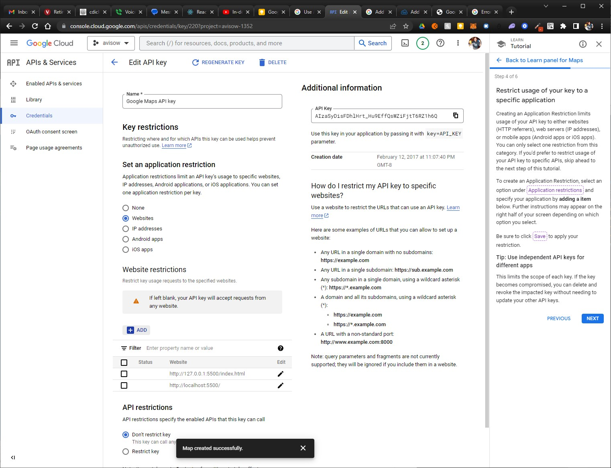

# google-maps_01
Load the Maps JavaScript API by using Dynamic Library Import

## References
* [Add a Google Map with a marker to your website](https://developers.google.com/maps/documentation/javascript/adding-a-google-map#maps_add_map-typescript)
* [Load the Maps JavaScript API](https://developers.google.com/maps/documentation/javascript/load-maps-js-api)

## Restrict Your API Key
  1. Go to Google Maps Credentials
    
  2. Edit the API Key
    
  3. Add **Key restrictions** by *Application Restriction* or *API Restrictions*
    